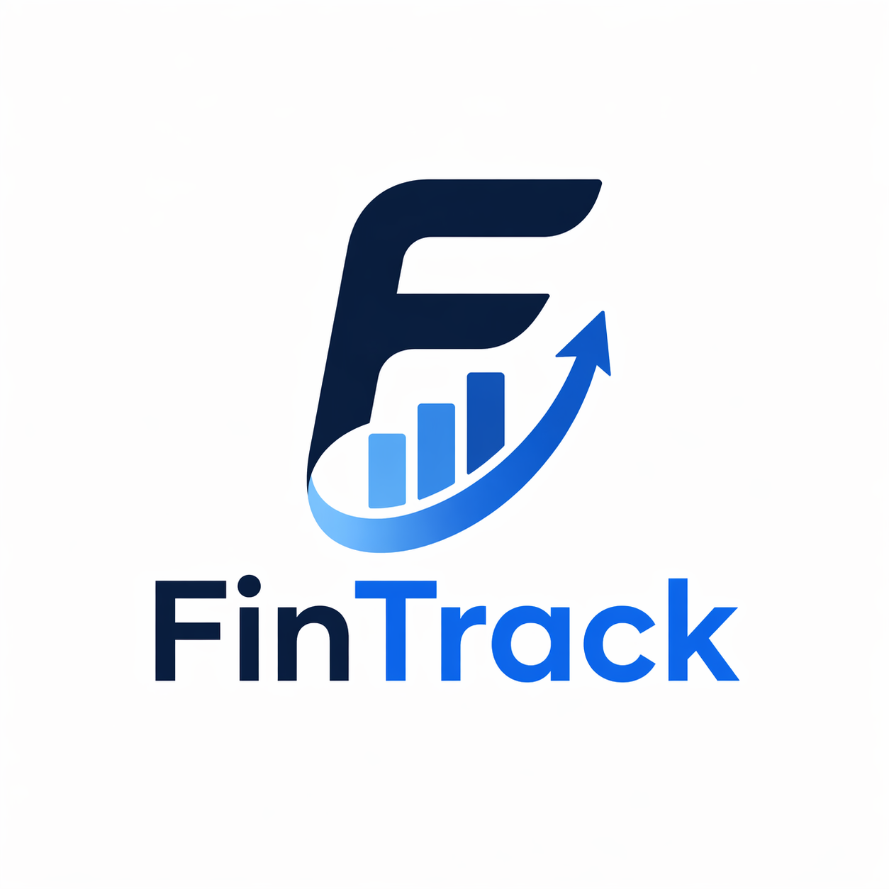

# 📊 FinTrack AI

<div align="center">
  
</div>

**FinTrack AI** is a modern, responsive personal finance tracking application designed to help users manage their income, expenses, and budgets seamlessly. What makes FinTrack AI unique is its **intelligent Telegram Bot integration**, allowing users to log transactions and check their balances on-the-go with natural language messaging.

---

## ✨ Key Features

### 🖥️ Web Dashboard & Analytics
- **Live Dashboard**: Real-time aggregation of your "Current Balance", "Total Income", and "Total Expenses" for the current month.
- **Dynamic Budget Progress**: Color-coded progress bars visually indicate your budget health (Green = Safe, Yellow = Approaching Limit, Red = Over Budget).
- **Interactive Reports**: Visualize your spending habits with dynamic Pie Charts and Bar Charts (powered by Recharts) that react to Month/Year filters.
- **Proactive Alerts**: Immediate toast notifications warn you when you approach (80%) or exceed your category budget limits.

### 🤖 Telegram Bot Integration
- **Conversational Logging**: Simply message the connected Telegram bot (e.g., *"spent 350 THB on lunch"*) to instantly log transactions to your database.
- **Secure Linking**: Generate a secure, 6-character, time-limited link code from your Web Settings page to pair your Telegram account to your FinTrack dashboard safely.

### ⚙️ Core Management
- **Transaction Management**: Add, edit, delete, and categorize your transactions with ease.
- **Advanced Filtering & Search**: Filter transactions by Income/Expense, specific categories, or search by description in real-time.
- **Data Export**: Instantly export your filtered transaction list to a native `.csv` file for external accounting.
- **Global Dark Mode**: Fully supported dark mode toggle that persists across your sessions.

---

## 🛠️ Technology Stack

FinTrack AI is built with a modern, type-safe stack:

*   **Frontend**: React 18, TypeScript, Vite
*   **Routing**: React Router DOM v6
*   **Backend & Auth**: Supabase (PostgreSQL, Row Level Security)
*   **State & Data Fetching**: TanStack Query v5 (React Query)
*   **Forms & Validation**: React Hook Form + Zod
*   **UI & Styling**: Tailwind CSS, shadcn/ui
*   **Charts**: Recharts

---

## 🚀 Getting Started

### Prerequisites
- Node.js (v18 or higher)
- A [Supabase](https://supabase.com/) project

### 1. Clone & Install
```bash
git clone https://github.com/yourusername/fintrack-ai.git
cd fintrack-ai
npm install
```

### 2. Environment Setup
Create a `.env` file in the root of your project and add your Supabase credentials:
```env
VITE_SUPABASE_URL=your_supabase_project_url
VITE_SUPABASE_ANON_KEY=your_supabase_anon_key
```

### 3. Database Schema setup
Run the necessary SQL scripts in your Supabase SQL Editor to set up the backend structure:
1. Ensure the `transactions` table has a `recurrence` text column.
2. Create the `budgets` table with a unique constraint on `(user_id, category_id, month, year)`.
3. Create the `telegram_link_codes` table with an `expires_at` default of `now() + interval '15 minutes'`.
4. Enable **Row Level Security (RLS)** to ensure data privacy across all tables.

### 4. Run Locally
```bash
npm run dev
```
Open your browser to `http://localhost:5173` to view the application!

---

## 📱 How to Connect Telegram

1. Open the FinTrack AI Web Application and navigate to the **Settings** page.
2. Click **Generate Code** under the "Connect Telegram" section.
3. Open Telegram and start a chat with the FinTrack AI Bot.
4. Send the 6-character code to the bot.
5. Your accounts are now linked! You can immediately start logging transactions via chat.

---

## 📝 License

This project is licensed under the MIT License.
